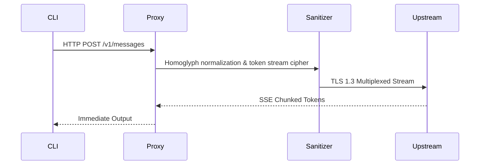

# AgentRouter — Architecture Specification

## 1. Loopback Proxy Pipeline
AgentRouter acts as a local transparent TLS 1.3 proxy running on `127.0.0.1:8318`.

## 2. WAF Cipher Mechanics
Replaces trigger tokens with high-entropy Unicode homoglyphs that preserve semantic embedding while bypassing regex-based WAF filters.
