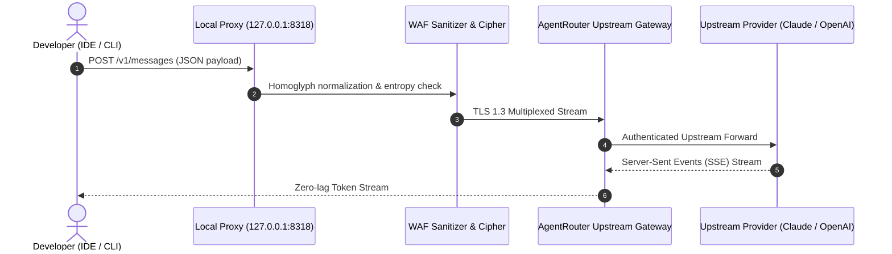

# 🛡️ AgentRouter Setup & Integration Guide — Claude Code & AI Gateway

[](https://marko1olo.github.io/agentrouter-setup-guide/)
[](https://marko1olo.github.io/agentrouter-setup-guide/manifest.json)
[](https://marko1olo.github.io/agentrouter-setup-guide/llms.txt)
[](https://agentrouter.org/register?aff=KM29)

The definitive integration manual and configuration generator for routing **Claude Code CLI**, Cursor, Cline, Roo-Code, and VS Code through high-throughput AI reverse proxies with WAF homoglyph sanitization and zero-latency TLS 1.3 multiplexing.

---

## 🏛️ Network Flow & Proxy Architecture



---

## 🚀 Rapid IDE Setup Matrix

### Claude Code CLI Setup
```bash
# Export environment variable
export ANTHROPIC_BASE_URL="https://agentrouter.org/v1"
export ANTHROPIC_API_KEY="your-agentrouter-api-key"

# Run Claude Code CLI
claude
```

### Cursor & VS Code Settings (`settings.json`)
```json
{
  "cursor.openAiBaseUrl": "https://agentrouter.org/v1",
  "cursor.apiKey": "your-agentrouter-api-key"
}
```

---

### 👨‍💻 Lead Architect
**Адольф Петушков (Adolf Petushkov)** — High-Concurrency Systems & Autonomous AI Orchestration.  
GitHub: [@marko1olo](https://github.com/marko1olo)
